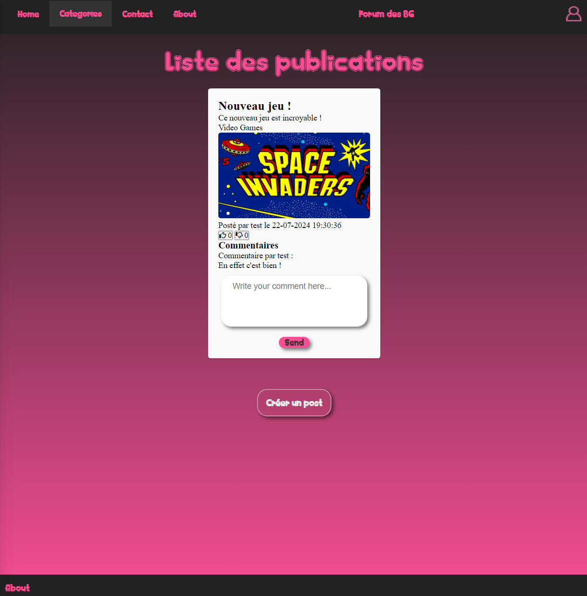
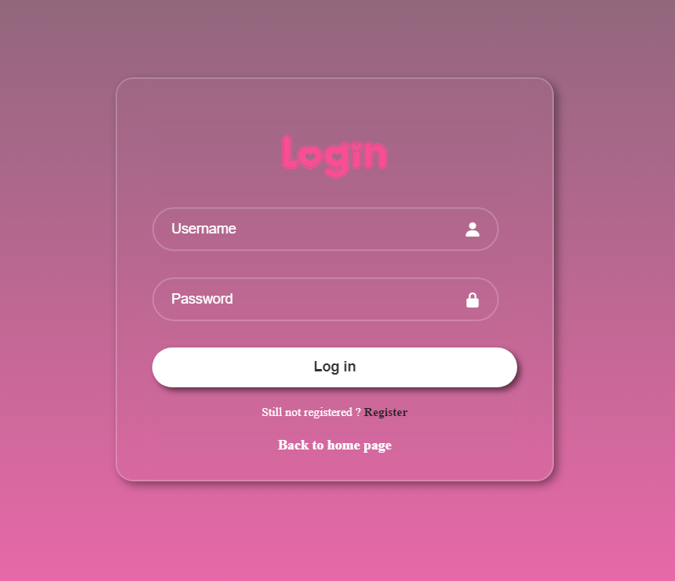

# Forum - Documentation

This project was done in pairs.

## Table of Contents
I. [Project Overview](#i-project-overview)  
II. [Development Environment](#ii-development-environment)  
III. [Tech Stack](#iii-tech-stack)  
IV. [How to Install the Project](#iv-how-to-install-the-project)  
V. [Usage](#v-usage)  
VI. [Web Application Screenshots](#vi-web-application-screenshots)  
VII. [Improvement Suggestions](#vii-improvement-suggestions)  
VIII. [Post Scriptum](#viii-post-scriptum)  

## I. Project Overview

The Forum project involves creating a server in Golang to run a website (forum), managed by an SQLite database. 
The CRUD operations were developed in Golang to allow the retrieval of data from the database and to send it to the forum.

The objective was to allow users to register and log in, create posts, leave comments, and like/dislike posts if they are logged in. If a user is not logged in, they can still view the posts.

## II. Development Environment

- **Institution**: Rennes Ynov Campus
- **Study Level**: First year in Bachelor's degree in Computer Science
- **Project Duration**: 1 month
- **Main Constraints**:
    - Work done in pairs
    - Golang server
    - Data management via SQLite
    - User management
    - Session cookie handling

## III. Tech Stack

- **Languages**: Golang, HTML/CSS, and JavaScript
- **Database**: SQLite

## IV. How to Install the Project

### 1 - Prerequisites

Before anything, you need a C compiler. If you don’t have one, follow these steps:

- Download the ZIP file from this [link](https://github.com/brechtsanders/winlibs_mingw/releases/download/14.1.0posix-18.1.5-11.0.1-ucrt-r1/winlibs-x86_64-posix-seh-gcc-14.1.0-mingw-w64ucrt-11.0.1-r1.zip)
- Extract the folder inside
- Move the folder to **C:\Program Files**
- Find the **bin** folder and copy the path
- In the Windows search bar, search for *"Environment Variables"* and click **Edit the system environment variables**
- Click **Environment Variables**
- In *"System variables"*, select **Path** and click **Edit**
- Paste the copied link at the end of the file and click *"Ok"* to close the windows
- Then, open your cmd, Visual Studio Code, or your usual IDE
- Paste the command in the terminal: **$env:CGO_ENABLED=1**  
- Wait for the command to finish and then restart your IDE

Now you're ready to use this project.

### 2 - Clone the Repository

Navigate to the directory where you want to clone the repository.
Then, open your cmd, Visual Studio Code, or your preferred IDE, and run the following command:
``git clone https://github.com/Elouanche/Forum_GO.git``

## V. Usage

At the root of the project, run **make build** and then **make run** to compile and start the project. 
Once you’re done testing the forum, don't forget to use **make clean**.
If your project is compiled and you want to restart the forum, you can run: **make restart**.

## VI. Web Application Screenshots

Here is the general interface of the Forum:  

  

## VII. Improvement Suggestions

### 1 - Likes/Dislikes

The implementation of likes and dislikes has been done, and we can now like a post. This like (or dislike) is stored in the database linked to a user and a post.  
However, the incrementing feature on the website is not yet working, which is the main area for improvement in this project.

### 2 - Docker

Currently, it is possible to create a Docker image using the command:  
``docker build -t forum-app .``  
However, the image does not yet run.

## VIII. Post Scriptum

Thank you for trying out my project, and I hope you enjoyed it!
